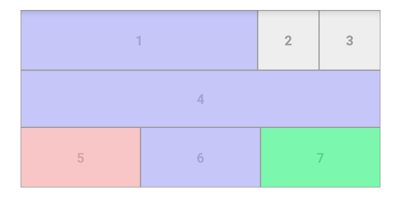

Probe
=====

Dissect layout traversals on Android.




Features
--------
- Intercept `View` methods.
  - `onMeasure(int, int)`
  - `onLayout(boolean, int, int, int, int)`
  - `draw(Canvas)` and `onDraw(Canvas)`
  - `requestLayout()`
- Override any of these methods on-the-fly.
- Layout debugging:
  - `OvermeasureInterceptor`: Tints views according to the number of times they got measured in a single traversal.
  - `LayoutBoundsInterceptor`: Equivalent to Android's "Show layout bounds" developer option. The main difference being that you can show bounds only for specific views.


Usage
-----

 1. Implement an `Interceptor`:

  ```java
  public class DrawGreen extends Interceptor {
      private final Paint mPaint;
  
      public DrawGreen() {
          mPaint = new Paint();
          mPaint.setColor(Color.GREEN);
      }
  
      @Override
      public void onDraw(View view, Canvas canvas) {
          canvas.drawPaint(mPaint);
      }
  }
  ```


 2. Deploy your `Interceptor` with an (optional) `Filter`:
 
 ```java
 public final class MainActivity extends Activity {
     @Override
     protected void onCreate(Bundle savedInstanceState) {
         Probe.deploy(this, new DrawGreen(), new Filter.ViewId(R.id.view2));
         super.onCreate(savedInstanceState);
         setContentView(R.id.main_activity);
     }
 }
 ```


Download
--------

Download [the latest JAR][1] or grab via Gradle:

```groovy
compile 'org.lucasr.probe:probe:0.1.2'
```

or Maven:

```xml
<dependency>
  <groupId>org.lucasr.probe</groupId>
  <artifactId>probe</artifactId>
  <version>0.1.2</version>
</dependency>
```


License
--------

    Copyright 2014 Lucas Rocha

    Licensed under the Apache License, Version 2.0 (the "License");
    you may not use this file except in compliance with the License.
    You may obtain a copy of the License at

       http://www.apache.org/licenses/LICENSE-2.0

    Unless required by applicable law or agreed to in writing, software
    distributed under the License is distributed on an "AS IS" BASIS,
    WITHOUT WARRANTIES OR CONDITIONS OF ANY KIND, either express or implied.
    See the License for the specific language governing permissions and
    limitations under the License.


 [1]: https://oss.sonatype.org/service/local/artifact/maven/redirect?r=releases&g=org.lucasr.probe&a=probe&e=aar&v=LATEST
